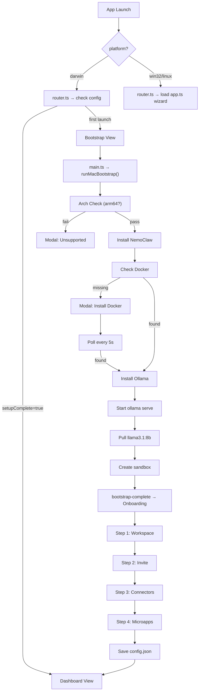

# Walkthrough: macOS Bootstrap + open-coot Onboarding

## Summary

Refactored the NemoClaw Electron app into a **dual-flow architecture**:

- **macOS (darwin)**: Silent bootstrap → 4-step open-coot onboarding → dashboard
- **Windows/Linux**: Existing 6-step wizard installer — **completely untouched**

Build verified: **zero errors**, all output files generated correctly.

---

## Architecture Overview



---

## Files Changed

### 6 New Files

---

#### [NEW] [config-service.ts](file:///c:/Users/rrahu/Desktop/nemoclaw/src/main/config-service.ts)

**Config persistence layer.** Stores `config.json` at `app.getPath('userData')/config.json`.

- `getConfig()` — reads JSON, returns `null` if missing
- `saveConfig(partial)` — merges with existing, writes atomically
- `isFirstLaunch()` — returns `true` if config missing or `setupComplete === false`
- Registers 3 IPC handlers: `get-config`, `save-config`, `is-first-launch`

Config schema:
```json
{
  "setupComplete": true,
  "workspaceType": "family",
  "tools": ["n8n", "Notion"],
  "teamSize": "2-5",
  "connectors": { "local-files": true, "google-drive": true },
  "microapps": ["finance", "knowledge"],
  "invites": [{ "email": "...", "role": "member" }],
  "sandboxName": "open-coot-default",
  "provider": "ollama",
  "model": "llama3.1:8b",
  "configVersion": 1
}
```

---

#### [NEW] [mac-bootstrap.ts](file:///c:/Users/rrahu/Desktop/nemoclaw/src/main/mac-bootstrap.ts)

**Silent macOS first-launch bootstrap runner.** Executes these steps sequentially:

| # | Step | Command | On Fail |
|---|------|---------|---------|
| 1 | Arch check | `os.arch()` — must be `arm64` | Show modal, stop |
| 2 | NemoClaw check | `bash -l -c "nemoclaw --version"` | Install below |
| 3 | NemoClaw install | `curl -fsSL https://www.nvidia.com/nemoclaw.sh \| bash` | Stop |
| 4 | Docker check | `docker info` | Show Docker modal |
| 5 | Docker wait | Poll `docker info` every 5s | Block until found |
| 6 | Ollama check | `ollama list` | Install below |
| 7 | Ollama install | `curl -fsSL https://ollama.com/install.sh \| sh` | Stop |
| 8 | Start service | `ollama serve` (or `open -a Ollama`) | Stop |
| 9 | Model check | `ollama list \| grep llama3` | Pull below |
| 10 | Model pull | `ollama pull llama3.1:8b` | Stop |
| 11 | Create sandbox | `nemoclaw onboard --non-interactive --name open-coot-default` | Stop |

Each step emits `bootstrap-progress` events to the renderer with `{ stage, status, message, progress }`.

> [!NOTE]
> No Homebrew dependency — Ollama is installed via the official install script per your decision.

---

#### [NEW] [router.ts](file:///c:/Users/rrahu/Desktop/nemoclaw/src/renderer/router.ts)

**Client-side view router.** Replaces `app.ts` as the HTML entry script.

```
Platform check:
  win32/linux → import('./app') → existing wizard
  darwin + setupComplete → import('./dashboard-view')
  darwin + first launch → import('./bootstrap-view')
```

Exports navigation helpers: `navigateToOnboarding()`, `navigateToDashboard()`

---

#### [NEW] [bootstrap-view.ts](file:///c:/Users/rrahu/Desktop/nemoclaw/src/renderer/bootstrap-view.ts)

**Bootstrap loading screen** shown during silent setup:

- open-coot logo + animated progress bar (0-100%)
- 6 step indicators with live status dots (running/done/error)
- Stage label updates ("Installing NemoClaw...", "Pulling model...", etc.)
- **Docker modal**: Title "Docker Required", Install + Retry buttons
- **Architecture modal**: "Apple Silicon only" message + Close button
- Error state with Retry button (reloads app)

---

#### [NEW] [onboarding-view.ts](file:///c:/Users/rrahu/Desktop/nemoclaw/src/renderer/onboarding-view.ts)

**4-step onboarding wizard** using open-coot design system:

| Step | UI Components | State Captured |
|------|--------------|----------------|
| 1. Workspace Setup | PurposeCard grid (4 options), TechPill multi-select (8 pills), SizeCard grid (4 sizes) | `workspaceType`, `tools[]`, `teamSize` |
| 2. Invite Members | Email input + role select, pending invites list, role legend | `invites[]` |
| 3. Connectors | 6 ConnectorCards (Local Files, Drive, Slack, Notion, GitHub, OneDrive) with toggle connect | `connectors{}` |
| 4. Microapps | 6 MicroappCards (Finance, Knowledge, Projects, HR, Support, Custom) with recommended badges | `microapps[]` |

On "Launch open-coot" → saves `config.json` with `setupComplete: true` → routes to dashboard.

> [!IMPORTANT]
> Sandbox is **NOT** recreated at Step 4 — it was already created during bootstrap, per your decision.

---

#### [NEW] [dashboard-view.ts](file:///c:/Users/rrahu/Desktop/nemoclaw/src/renderer/dashboard-view.ts)

**open-coot dashboard** matching the design reference:

- **Sidebar**: Logo, nav groups (Workspace/Sources/Microapps/People), LLM status indicator
- **Top bar**: "Dashboard" title, "+ New Workflow" button, avatar
- **Stats grid**: 4 cards (Workflows, Runs, Connectors, Team Members) — populated from config
- **Workflows panel**: 4 placeholder workflow rows with status dots
- **Right column**: Runtime status (sandbox + provider), connectors list, active microapps
- Microapps in sidebar are dynamically shown based on user selections

All data is **placeholder** for now — real runtime integration will come later.

---

### 6 Modified Files

---

#### [MODIFY] [types.ts](file:///c:/Users/rrahu/Desktop/nemoclaw/src/shared/types.ts)

Added:
- `AppConfig` interface (config.json schema)
- `InviteEntry` interface
- `BootstrapStage` union type (12 stages)
- `BootstrapEvent` interface
- 10 new methods on `ElectronAPI` (config, bootstrap, Docker modal, arch check)

---

#### [MODIFY] [main.ts](file:///c:/Users/rrahu/Desktop/nemoclaw/src/main/main.ts)

- Imports `registerConfigHandlers` from config-service
- Imports `runMacBootstrap` from mac-bootstrap
- Calls `registerConfigHandlers()` at startup
- After `createWindow()`, checks `platform === 'darwin' && isFirstLaunch()`
- If true: waits for renderer `did-finish-load`, then runs `runMacBootstrap(mainWindow)` after 500ms delay

---

#### [MODIFY] [ipc-handlers.ts](file:///c:/Users/rrahu/Desktop/nemoclaw/src/main/ipc-handlers.ts)

Added 2 new IPC handlers:
- `open-docker-download` — opens Docker Desktop URL
- `retry-docker` — no-op (polling handled by bootstrap module)

All existing wizard handlers completely untouched.

---

#### [MODIFY] [preload.ts](file:///c:/Users/rrahu/Desktop/nemoclaw/src/preload/preload.ts)

Added these methods to the `contextBridge`:
- `getConfig`, `saveConfig`, `isFirstLaunch` — config APIs
- `onBootstrapProgress`, `onDockerMissing`, `onArchUnsupported`, `onBootstrapComplete` — event listeners
- `removeBootstrapListeners` — cleanup
- `retryDocker`, `openDockerDownload` — Docker modal actions

---

#### [MODIFY] [index.html](file:///c:/Users/rrahu/Desktop/nemoclaw/src/renderer/index.html)

- Added `<div id="oc-root" style="display:none"></div>` for macOS views
- Changed entry script from `app.ts` to `router.ts`
- Added Inter 800 weight to Google Fonts import
- Title changed to "open-coot — AI Workspace"

---

#### [MODIFY] [styles.css](file:///c:/Users/rrahu/Desktop/nemoclaw/src/renderer/styles.css)

Added **~1,270 lines** of open-coot design system CSS, all scoped under `oc-*` prefix:

- Design tokens (`--oc-bg`, `--oc-primary`, `--oc-success`, etc.)
- Window chrome (macOS traffic lights)
- Shared components (buttons, badges, status dots, inputs, spinner)
- Bootstrap view (logo, progress bar, step indicators, modals, error state)
- Onboarding view (progress bar, purpose grid, tech pills, size grid, invite rows, connector cards, microapp cards)
- Dashboard view (sidebar, nav items, stats grid, workflow rows, panel layout)

Zero conflicts with existing wizard styles.

---

## Verification Results

| Check | Result |
|-------|--------|
| `npm run build` | ✅ Zero errors |
| Output files | ✅ All 6 chunks generated (`app`, `bootstrap-view`, `onboarding-view`, `dashboard-view`, `router`, CSS) |
| `npm run dev` on Windows | ✅ Existing wizard loads correctly |
| Existing `app.ts` | ✅ Completely untouched |
| Existing `system-checks.ts` | ✅ Completely untouched |

---

## What to Test on macOS

When you deploy this to a Mac (M1+):

1. **First launch** → should show bootstrap loading screen → silently install NemoClaw → check Docker → install Ollama → pull llama3.1:8b → create sandbox → transition to onboarding
2. **Complete onboarding** → select workspace type, tools, team size → skip/add invites → toggle connectors → select microapps → "Launch open-coot"
3. **Check `config.json`** at `~/Library/Application Support/nemoclaw-installer/config.json`
4. **Re-launch app** → should skip bootstrap + onboarding, go directly to dashboard
5. **Test Docker modal** → close Docker Desktop before first launch, verify modal appears with Install/Retry
6. **Test on Intel Mac** → should show "Apple Silicon only" modal and not proceed
